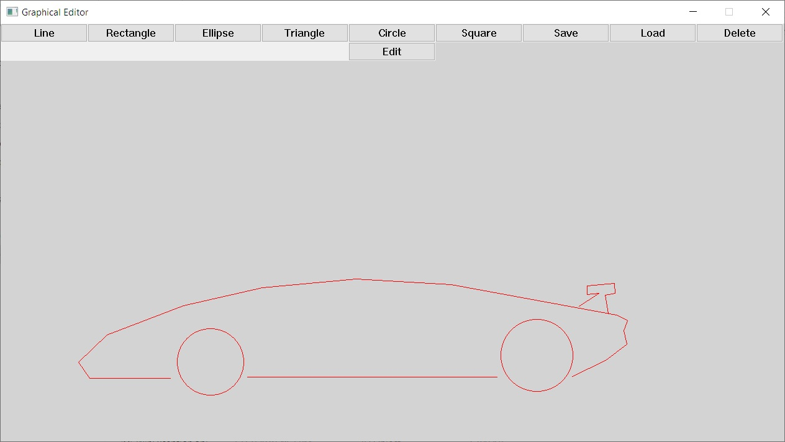

# Simple Graphics Editor

- Version: **1.0.1**
- Performed by: **[Maxim Scherbakov](https://t.me/maxnevans)**
- External libraries:
  - [GDI+](https://docs.microsoft.com/en-us/windows/desktop/gdiplus/-gdiplus-gdi-start)
  - [pugixml](https://pugixml.org/)

#### Technical Requirements:

- Windows XP, 7, 8, 10 x86/x64
- RAM 16 MB and more
- Mouse, keyboard

#### Capabilities:

- Create vector graphics with
  - Lines
  - Circles
  - Ellipses
  - Squares
  - Rectangles
  - Triangles
- Save your work in text human-readable format
- Create your own shapes with
  - Plugins
  - User shapes
- Save your workspace into XML config file
- And more..